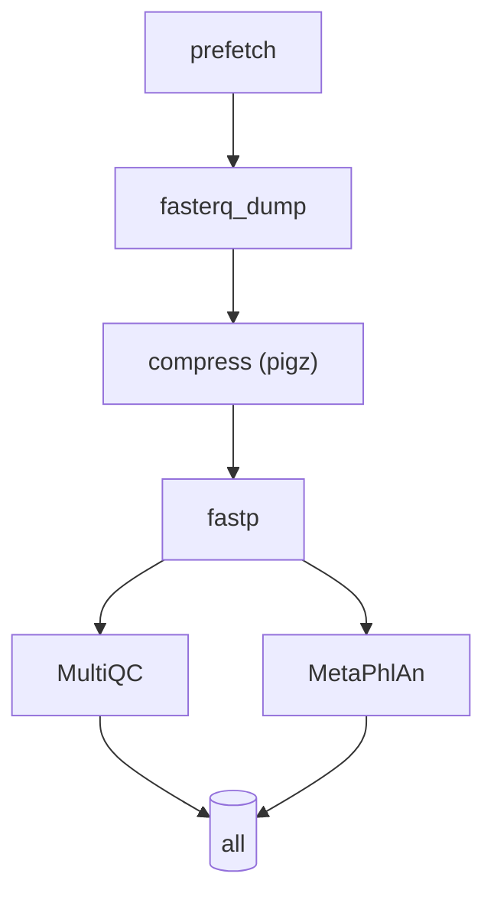

````markdown

# Metagenome-10× 🚀  
*A lightning-fast Snakemake pipeline that auto-downloads any public **BioProject** and processes the **first 10 paired-end samples** end-to-end: **download → QC → taxonomic profiling → reports**.*

Designed for:

* 🔬 **Rapid pilot studies** – sanity-check datasets before scaling to hundreds of samples.  
* 🎓 **Teaching labs & workshops** – a bite-sized workflow that still showcases best practices.  
* 🧪 **Benchmarking** – compare new tools on a consistent, reproducible backbone.

---

## ✨ Key features

|  |  |
| --- | --- |
| **`get_srrs.sh` helper** | One-liner that calls the ENA API and writes *exactly* 10 paired-end SRR IDs to `metadata/srr_ids.txt`. |
| **Modular rules** | `prefetch` → `fasterq_dump` → `compress` → `fastp` → `multiqc` → `metaphlan`. |
| **Single-file config** | All tunables (threads, memory, paths, databases) live in `config.yaml`. |
| **Reproducible Conda env** | `environment.yml` pins `snakemake`, `sra-tools`, `fastp`, `kraken2`, `bracken`, `diamond`, etc. |
| **Laptop-to-cluster ready** | Run `snakemake --cores 4` locally or attach an HPC/Cloud profile. |
| **Easy to extend** | Drop in extra rules (Kneaddata host removal, HUMAnN, assembly, binning) without touching the core. |

---

## 🚀 Quick start (five lines)

```bash
# 1. Clone
git clone https://github.com/YOURNAME/metagenome-10x.git
cd metagenome-10x

# 2. Reproducible environment
conda env create -f environment.yml
conda activate gut-microbiome

# 3. Grab 10 SRRs from your BioProject (default: PRJEB43097, edit inside get_srrs.sh)
./get_srrs.sh            # writes metadata/srr_ids.txt

# 4. Dry-run & visualize DAG
snakemake -n --dag | dot -Tpng > workflow_dag.png   # requires graphviz

# 5. Launch the pipeline 🚀
snakemake --use-conda --cores 4
````

Open **`results/multiqc/multiqc_report.html`** in your browser for an at-a-glance QC summary.

---

## 🗺️ Workflow overview

> Regenerate anytime with `snakemake --dag` (GitHub renders Mermaid).



---

## ⚙️ Configuration (`config.yaml`)

```yaml
raw_dir: "data/clean"          # final gzipped FASTQs
sra_dir: "data/sra"            # .sra files
fq_dir:  "data/fq"             # intermediate FASTQ
threads: 2                     # default threads per rule
mem_mb: 1000                   # default memory (MB)
kraken_db:  "databases/kraken2db"
diamond_db: "databases/nr"
srr_list_file: "metadata/srr_ids.txt"
```

Change paths, threads, memory—or point to pre-downloaded databases—in a single file.

---

## 📂 Output structure

```
data/
 ├─ sra/            # raw .sra files (prefetch)
 ├─ fq/             # intermediate FASTQ (fasterq_dump)
 └─ clean/          # compressed FASTQ (.gz)

results/
 ├─ fastp/          # per-sample HTML & JSON QC
 ├─ multiqc/        # aggregated QC (HTML)
 └─ metaphlan/      # {SRR}_profile.txt
```

Each step is cached; rerunning the pipeline skips completed files automatically.

---

## 🔧 Extending the pipeline

| Goal                          | Add/modify rule(s)                                             |
| ----------------------------- | -------------------------------------------------------------- |
| **Host read removal**         | Insert `kneaddata` between **compress** and **fastp**.         |
| **Kraken2/Bracken profiling** | Branch in parallel to MetaPhlAn after **fastp**.               |
| **Functional annotation**     | DIAMOND + HUMAnN3 downstream of **fastp**.                     |
| **Assembly & binning**        | MEGAHIT → MetaBAT2 → CheckM branch.                            |
| **Cloud scaling**             | Use Snakemake executor profiles (e.g., AWS Batch, Kubernetes). |

---

## 🖇️ Repository layout

```
.
├── Snakefile               # workflow logic
├── config.yaml             # user-tunable settings
├── environment.yml         # reproducible Conda env
├── get_srrs.sh             # fetch 10 SRR IDs from ENA
├── metadata/
│   └── srr_ids.txt         # auto-generated list of SRRs
├── results/                # pipeline outputs (git-ignored)
├── docs/                   # optional sphinx/mkdocs site
├── tests/                  # tiny 2-sample dataset + CI sanity test
├── .github/workflows/ci.yml# CI: lint + dry-run each PR
├── .gitignore
├── LICENSE
└── README.md               # ← you are here
```

---

## 🤝 Contributing

1. **Fork**, create a feature branch, code away.
2. Run `snakemake --lint` and `snakemake -n` (dry-run) – CI must stay green.
3. Submit a pull request describing *why* the change helps end-users.

---

## 📜 License

Distributed under the **GPL-3.0** License – see `LICENSE` for full text.

---

## 📖 Citation

If this pipeline supports your research, please cite via [`CITATION.cff`](CITATION.cff) or the Zenodo DOI on the GitHub release page.

> *“Start small, iterate fast, scale wisely.”* – **Metagenome-10×** team
> Happy metagenoming! 🎉

```


